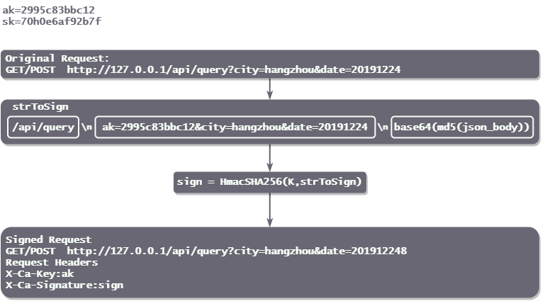

# springboot-api-sign

## API签名demo

**part1：请求端加密**

API使用者会获取到服务器颁发的ak和sk两个秘钥，ak为公钥，sk为私钥。

签名有以下规则：

1. 约定请求时会携带ak作为参数并放入HTTP Header。
2. 请求参数处理：
   - GET：取出所有的参数，并根据key进行字典排序，拼装成如下格式。
   - POST：如果是`application/x-www-form-urlencoded`，直接取出和GET参数进行排序拼接，如果是`application/json`，则直接将整个json串md5加密后再base64。

```
GET:
strToSign = uri + "\n" + k1=v1Z&k2=v2&k3=v3
POST:
strToSign = uri + "\n" + k1=v1Z&k2=v2&k3=v3 + "\n" + base64(md5(json_body))
```

3. 使用HmacSHA256算法，传入sk进行签名计算，`sign = HmacSHA256(K,strToSign)`。
4. 组装HTTP请求，将`X-Ca-Key=ak,X-Ca-Signature=sign`添加到HTTP Header中进行请求。

一个简单实例如下图所示：

